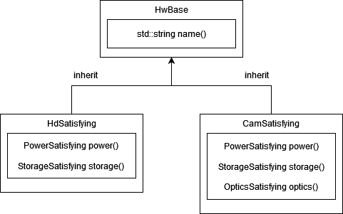

# hw-test

## Description

Use concepts in c++20 to put compiler enforced constraints on types passed to template classes.

## Architecture

Each type of hardware inherits from a base class that contains only those things truly shared by all hardware.

Then we build out the rest of each hardware class using composition.

The test runner template classes use concepts to constrain the types they will accept for instantiation.  The word Satisfying is used in the class names to indicate that they are satisfying the concept constraints.
